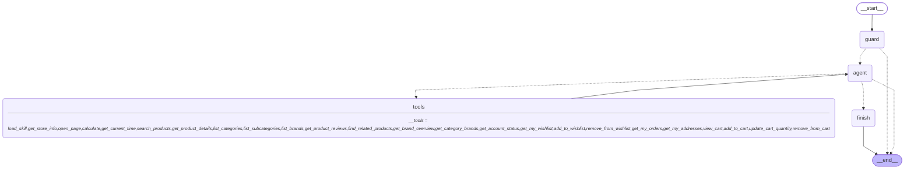

# Assistant graph

Generated by `npm run agent:graph` from `lib/ai/agent.ts`. Don't edit by hand.

```mermaid
%%{init: {'flowchart': {'curve': 'linear'}}}%%
graph TD;
	__start__([<p>__start__</p>]):::first
	guard(guard)
	agent(agent)
	tools(tools<hr/><small><em>__tools = load_skill,get_store_info,open_page,calculate,get_current_time,search_products,get_product_details,list_categories,list_subcategories,list_brands,get_product_reviews,find_related_products,get_brand_overview,get_category_brands,get_account_status,get_my_wishlist,add_to_wishlist,remove_from_wishlist,get_my_orders,get_my_addresses,view_cart,add_to_cart,update_cart_quantity,remove_from_cart</em></small>)
	finish(finish)
	__end__([<p>__end__</p>]):::last
	__start__ --> guard;
	finish --> __end__;
	tools --> agent;
	guard -.-> agent;
	guard -.-> __end__;
	agent -.-> tools;
	agent -.-> finish;
	agent -.-> __end__;
	classDef default fill:#f2f0ff,line-height:1.2;
	classDef first fill-opacity:0;
	classDef last fill:#bfb6fc;

```
